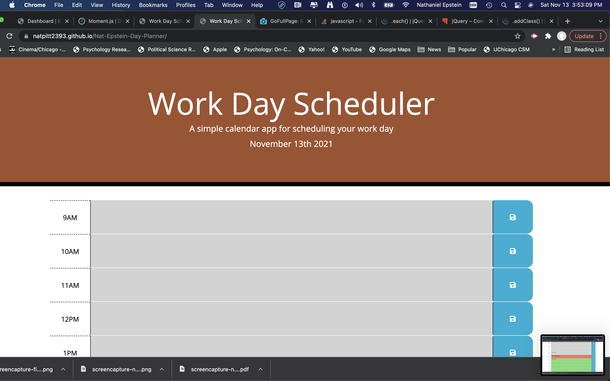
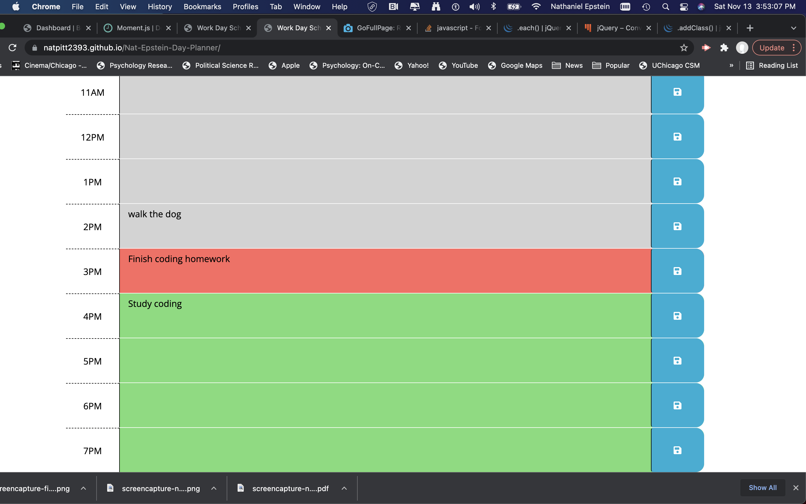

# Nat-Epstein-Day-Planner

Project Name: Nat Epstein Day Planner

Technologies Used: HTML5, CSS3, JavaScript, moment.js, jQuery, Bootstrap

Description: In order to initially set up the actual formatting of each time block, I had to first go to the CSS file and look at the starter code given. Certain classes such as description (this is where the description of the errand was) were needed to be put into the html in order for the css to be applied. Each hour was given a row with the corresponding task and a save button that would allow the items to be saved to local storage and then retrieved from the local computer if the page was reloaded. After each hour was given an ID to be able to be accessed in the JS file, I started on the logic of the program. 

The logic of the program had three different elements. One was to show the current day. The second was to have the text area for each hour to be able to be saved within local storage. Finally the logic to make sure that each color of the text area would change according to its relativity to the current time (future-green, past-gray, present-red). 

I also added two extra hours to the day planner because it's becoming increasingly common for the business day for many companies to extend past 5 PM. 

Known-bugs: N/A

URLs:[Nat Epstein Day Planner](https://natpitt2393.github.io/Nat-Epstein-Day-Planner/)

[napitt2393/Nat-Epstein-Day-Planner](https://github.com/natpitt2393/Nat-Epstein-Day-Planner)
      

Screenshots of website: 	

Sources: https://fontawesome.com/v5.15/icons/save?style=solid (this was so I could use the save icon in font awesome)

